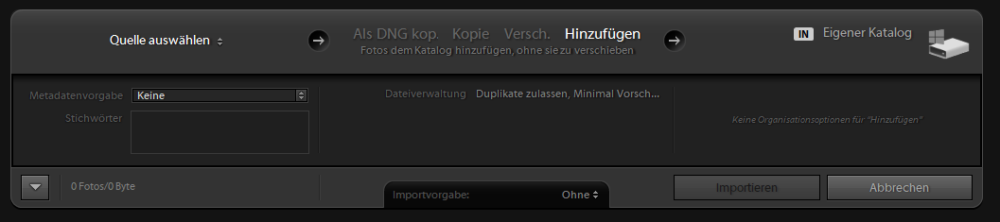
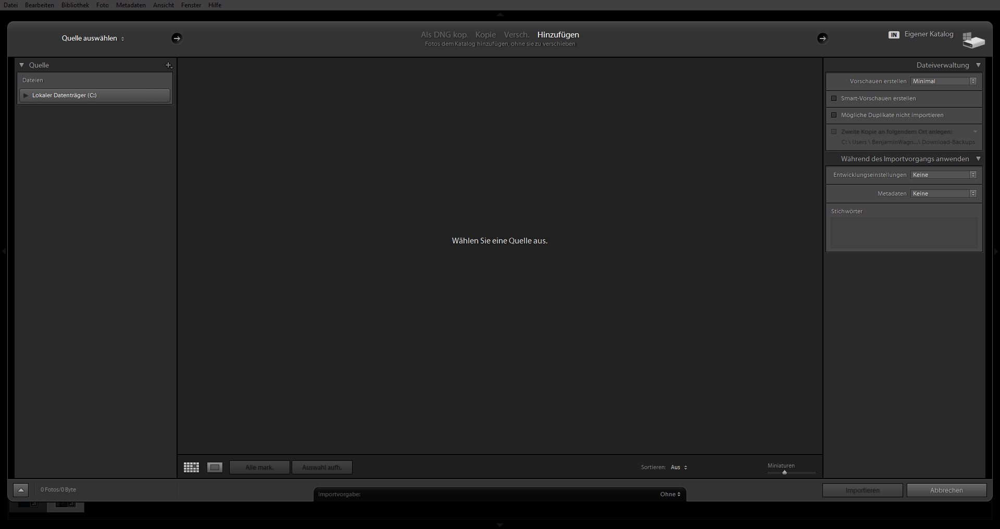

\newpage
\section{Importieren von Bildern}

# Quelle auswählen

Bevor es an die Nachbearbeitung deiner Bilder geht. gilt es zunächst, diese zu importieren. Am besten so, dass du sie später schnell und einfach wiederfindest.

Wenn dir nur der einfache Importdialog angezeigt wird, kannst du ihn erweitern, indem du auf den Pfeil unten links klickst.

Das Importfenster gliedert sich im wesentlichen in drei Spalten. Von links nach rechts sind das *Quelle*, *Bildauswahl* und *Ziel*. Wir schauen uns alle drei Bereiche nun genauer an.

# Dateiverwaltung

## Vorschauen erstellen

## Smartvorschauen

## Duplikate

## Zweite Kopie anlegen

# Während des Importvorgangs anwenden

