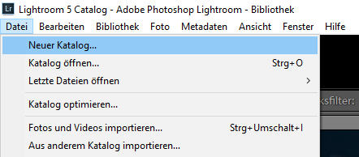

\newpage
\section{Katalogverwaltung}

Organisiere deine Bilder in Lightroom Classic -  aber richtig!
    
BRANDING

Wenn ich von Lightroom spreche, meine ich Lightroom Classic. Adobe bietet neben Lightroom Classic auch noch den Cloud Dienst Lightroom an, auf diesen werde ich in dieser Tutorialreihe jedoch nicht näher eingehen.
    
**Fangen wir mit den Basics an:**

Lightroom gliedert sich in verschiedene Arbeitsbereiche oder Tabs auf. Für den Anfang konzentrieren wir uns nur auf die ersten beiden Tabs, nämlich:
    
- Bibliothek
- Entwickeln

Im Tab **Bibliothek** organisierst du deine Bilder, dazu gehört auch der Im- und Export. Unter **Entwickeln** kannst du deine Bilder nachbearbeiten und ihnen den letzten Schliff verleihen.

# Katalog anlegen

Wir starten mit einem frischen Katalog. Lege ihn über das Menü "Datei" an.

Klicke auf "Neuer Katalog..." und wähle, wo der Katalog gespeichert werden soll. Es spielt eigentlich keine Rolle, wo du ihn speicherst. In dem Fall nehme ich den Desktop. Lightroom erstellt automatisch einen Unterordner. Hier findest du später alle Presets, Einstellungen, Vorschaubilder und mehr.

Wechsle nun zur Bibliothek (<kbd>Strg</kbd> + <kbd>G</kbd>). Noch nicht viel los hier. Also lass uns ein paar Bilder importieren, um zu beginnen.

Lies weiter unter [[20220803165547]] 3. Importieren von Bildern
